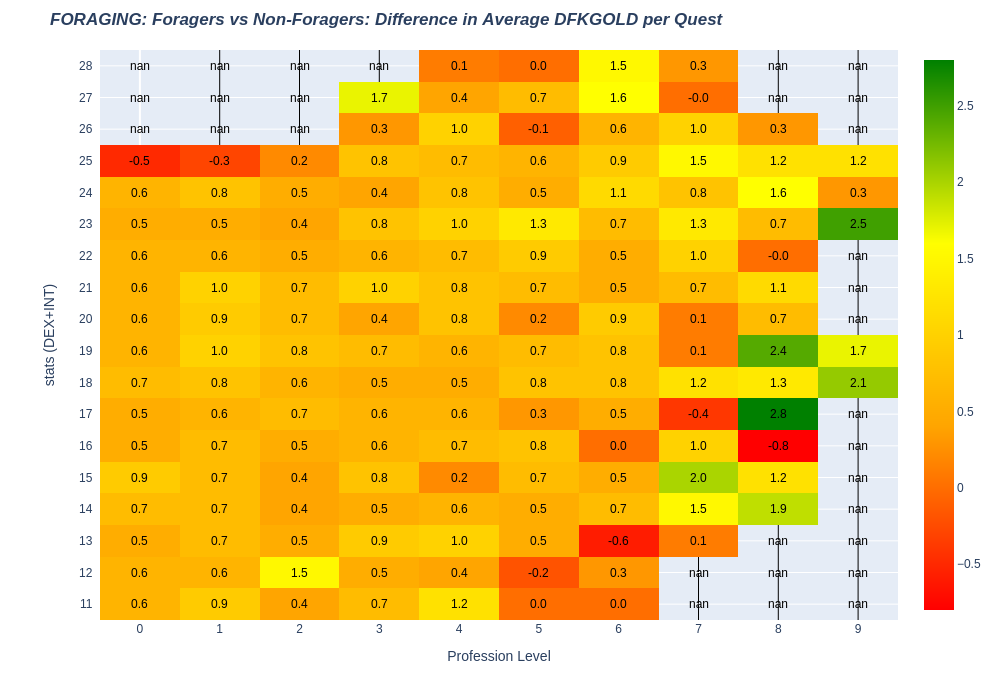
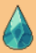

# Drop Rate for Fishing and Foraging DFK Quests

   

# Disclaimer

None of the authors are affiliated with DeFi Kingdoms. Nothing in this repository is financial advice.

# Introduction 

A data driven analysis about the drop rate for Fishing and Foraging profession quests is presented. 
We love DFK, we love data, and in here we aim to give a visual insight on two major aspects:
1. how hero stats and profession level influence item drop rate 
1. shall a hero with Foraging high stats and with fishing as main profession (as for example a fishing DreadKnight) do Foraging or Fishing?

The data (more than 8 Million quests) has been obtained via reverse engineering quest logs in the harmony block chain, so yes there could be bugs.
Data is available in the ./data/ folder in this repo. Eth hashes are included so it is possible to check its validity using the harmony explorer (one by one..). analysis.ipynb is the jupyter notebook used to process the data.
The code to scrap the data is not shared at the moment, it is far away from being optimal and able to run smoothly.

# TL;DR

Drop rate of items that can be sold for gold (Bloater, Goldvein..) rises as profession level increases, while does not vary with hero stats.
Gaia's Tears and Shivas rune drop rate depends on matching profession, and is not influenced by profession level, nor by stats.
A hero with Fishing (Foraging) main profession should go Fishing (Foraging).

A summary of the results in the image below.
 

# Analysis

In the following, a quest corresponds to one single quest attempt. That is to say, a hero performing N quests in one single transaction corresponds to N quests. 

##  Gold

In order to simplify the analysis, the corresponding DFKGOLD amount of the items obtained when questing (except for Gaia's Tear, Shivas Runes and Eggs) is considered as a term of comparison. If a fisher receives one Bloater and one Gaia's Tear when doing a quest, that correspond to 2.5 Gold.

### Fishing

 

Minimum drop rate for a fishing fisher (i.e. fishing is the main hero profession) is 5.1 gold per quest.
Drop rate increases with higher profession level, but does not seem to increase with higher stats.

 

Minimum drop rate for a fishing non-fisher is 4.2 Gold per quest.

The difference, cell by cell, of the two above graphs is shown below (for cells with enough samples).

 

When Fishing, fishers earn on average an extra 0.63 gold per quest in respect to non-fishers

### Foraging

 

Minimum drop rate for a foraging forager (i.e. foraging is the main hero profession) is 5.2 Gold per quest.

 

Minimum drop rate for a foraging non-forager is 4.6 gold per quest.

Below the difference between a forager and a non-forager is shown.

 

Foragers, on average, earn extra 0.7 gold per quest in respect to not-foragers when Foraging.

In addition to increasing by 40% the number of quests per day, matching hero main profession and quest profession results in an increased 0.6~0.7 gold per quest. 
Surprisinlgy, higher stats do not seem rising drop rate for Foraging and Fishing.
Therefore, it seems more efficient to always match main hero profession with quest profession.

### A Curious Comparison: Fishing Fishers vs Foraging Foragers

Below the difference between a foraging forager and a fishing fisher is shown.

 

Foragers seem to earn an average extra 0.2 gold per quest in respect to fishers. 

##  Gaia's Tears

The graph below shows Gaia's Tears drop rate in respect of profession level, for fishers and foragers with and without main hero profession <-> quest profession matching.

 

The graph below shows Gaia's Tears drop rate in respect of stats, for fishers and foragers with and without main hero profession <-> quest profession matching.

 

Matching profession quests have a flat 0.17 Gaia's Tears drop per quest, non matching professions 0.11.
Stats and profession level do not affect Gaia's Tears drop rate.

##  Shivas Rune

 

 

Matching profession quests have a flat 0.01 Shivas Rune drop per quest, non matching professions 0.002.
This is as for the specifications provided by DFK team.
Surprisingly, stats and profession level do not affect Shivas Rune drop rate.

###   Eggs
Given the low drop rate of Eggs, the amount of data is not sufficient to show any particular pattern.

# Possible Fututre Analysis

- Add xp and profession level increase per quest
- Add Gardening and Mining Profession quests
